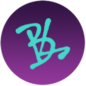

    
    <!--</img>-->
    <h3> Bianca Silva </h3>
    

         
        
         
    

---

### About
Responsive website developed as a curriculum complement and online portfolio, where some projects, courses, professional and school history, certificates and other contact information will be presented.

 - [Projects](https://biancafsilva.github.io/Portfolio/#team) 
 - [Contact](https://biancafsilva.github.io/Portfolio/#contact)

### Technology

    
    
    

### License
This project is under the [MIT license](LICENSE). Access for more details.
  
---

 ©BiancaFSilva 
